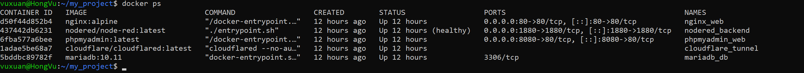
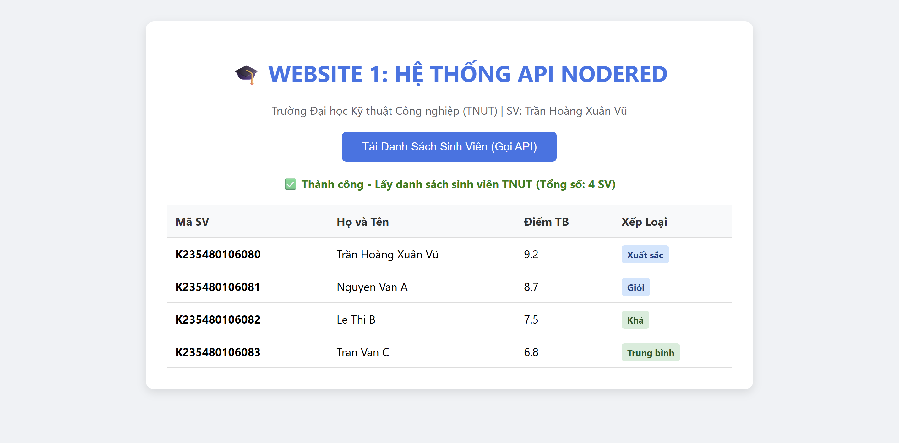
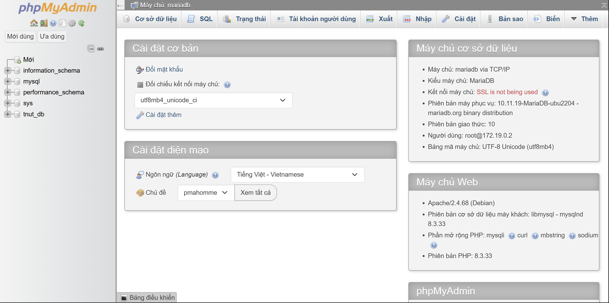

# BÀI TẬP VỀ NHÀ MÔN LẬP TRÌNH WEB - TNUT

## Thông tin sinh viên
* **Họ và tên**: Trần Hoàng Xuân Vũ
* **Mã sinh viên**: K235480106080
* **Lớp**: K59KMT - Kĩ thuật máy tính

## Danh sách đầy đủ đường link (Public Domain & GitHub Repo)
* **GitHub Repository**: https://github.com/k235480106080-glitch/BT_LapTrinhWeb_TNUT
* **Website 1 (Gọi API Node-RED)**: http://site1.hoangvu057.id.vn
* **Website 2 (Trang thứ hai)**: http://site2.hoangvu057.id.vn
* **Quản trị CSDL (phpMyAdmin)**: http://pma.hoangvu057.id.vn

## Báo cáo minh chứng kết quả thực hiện

### 1. Trạng thái 5 Docker Container

### 2. Website 1 - Gọi API Node-RED (http://site1.hoangvu057.id.vn)

### 3. Website 2 - Trang độc lập (http://site2.hoangvu057.id.vn)

### 4. Quản trị Database phpMyAdmin (http://pma.hoangvu057.id.vn)

